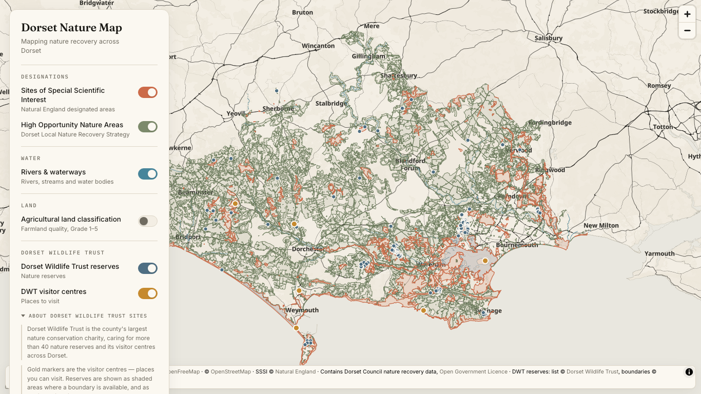

# South Coast Marine Recovery Map

A calm, editorial interactive map of the **South Coast Marine Recovery Project**
coastline — **Land's End to Beachy Head**, across Cornwall, Devon, Dorset,
Hampshire & the Isle of Wight, and Sussex. A cream/parchment canvas, thin
charcoal linework, and muted accent colours for the data.

This repo began as a clone of the **Dorset Nature Map** and keeps its whole
codebase. What changed: the marine layers now cover the full project coastline
instead of the Dorset coast, and the Dorset-only **land** layers are switched off
behind a feature flag (see [Feature flag](#feature-flag--the-dorset-land-layers)).
They are dormant, not deleted — ready to be re-enabled or extended to the other
counties.

**Live layers — the "At sea" group:**

- **Marine protected areas** — deep teal — 66 Marine Conservation Zones, marine
  SACs and coastal SPAs between Land's End and Beachy Head, drawn as outlined
  areas (solid / dashed / dotted by type) so the heavy overlaps stay legible.
  **Off by default.**
- **Coastal erosion risk** — a warm pale→clay ramp — how far each stretch of coast
  could erode by 2055 with no future intervention (Environment Agency NCERM).
  **Off by default.** *Note: this layer's bundled data is still **Dorset-only** —
  it has not yet been rebuilt for the wider coastline.*
- **Water body status** — a blue-green→dun scale — the Environment Agency's WFD
  ecological classification of the 59 coastal and estuarine water bodies on this
  coast (Cycle 4, 2025). Chemical status is on the card but not mapped, because
  every one of them fails it. **Off by default.**
- **Seabed habitats** — a cool stone palette — what the sea floor is made of,
  from JNCC's UKSeaMap. A broad-scale **predictive** model, not survey. **Off by
  default.**
- **Marine species** — NBN Atlas records for **18** marine species, as one dot
  per occupied grid square, placed in the sea rather than at the grid centre.
  Tick as many as you like from a grouped checklist. **Off by default.**
- **Storm overflows** (a subgroup, two layers):
  - **Annual spill data** — a pale rose→deep wine ramp — how many times each of
    1,903 storm overflows discharged in 2025 and for how long, from the
    Environment Agency's Event Duration Monitoring annual return. **Off by
    default.**
  - **Live discharge status** — is this overflow discharging *right now*, from the
    National Storm Overflow Hub. The only layer fetched at runtime; no API key
    needed. **Off by default.**

Every **off by default** layer is also **lazy** — it downloads nothing until its
toggle is first switched on (see [Layers load lazily](#layers-load-lazily)).

Which sites count as "on this coast" is decided by a **catchment boundary**, not a
box: a site is included if its water drains here, however far inland it sits (see
[The catchment boundary](#the-catchment-boundary--what-counts-as-on-this-coast)).
Some of those sites are well north of the opening view — up the Hampshire Avon
past Salisbury — so pan north to see them.

**Dormant behind the feature flag** (Dorset-only data): SSSIs, High Opportunity
Nature Areas, Dorset Wildlife Trust reserves & visitor centres, rivers &
waterways, Agricultural Land Classification, field crops (CROME), and notable
species (NBN Atlas).

Hovering any feature shows a small on-brand **info card** (name, type, area, a
short note — and, for marine sites, a "More info ↗" link to its national record).
Pan/zoom is bounded to the project coastline plus a margin out to sea.

The aesthetic is the point: a sibling to the Anthropic site / CRADLE. Warm,
restrained, lots of breathing room — the accents stay muted so the map stays calm.



## Quick start

```bash
npm install      # install dependencies
npm run dev      # start the dev server (opens http://localhost:5173)
```

That's it — the base map (OpenFreeMap) and all the bundled data layers work with
**no API keys**.

### Other commands

```bash
npm run build        # production build → dist/
npm run preview      # serve the production build locally
npm run data         # rebuild every data layer (see notes per layer below)
npm run data:sssi    # refresh the bundled SSSI GeoJSON from Natural England
npm run data:hona    # rebuild High Opportunity Nature Areas (needs the gpkg, see below)
npm run data:dwt     # refresh DWT reserves from OpenStreetMap (Overpass)
npm run data:centres # rewrite the curated DWT visitor-centre markers
npm run data:water       # rebuild watercourse lines GeoJSON from OSM
npm run data:water-named # rebuild the two named water bodies (Fleet + Poole Harbour)
npm run data:alc         # rebuild Provisional Agricultural Land Classification
npm run data:alc-post1988 # rebuild the detailed Post-1988 ALC resurvey (3a/3b)
npm run data:crome       # rebuild Field crops (CROME) vector tiles (needs tippecanoe)
npm run data:species     # rebuild the Notable species grid from the NBN Atlas
npm run data:marine      # rebuild marine protected areas (MCZ / marine SAC / coastal SPA)
npm run data:ncerm       # rebuild coastal erosion risk from the EA NCERM (WFS)
npm run data:catchment   # rebuild the hydrological (catchment) boundary — run BEFORE the two below
npm run data:storm-overflows # rebuild the EA EDM storm overflow annual return (latest year)
npm run data:wfd         # rebuild WFD coastal & transitional water body classifications
npm run data:seabed      # rebuild seabed habitats (JNCC UKSeaMap via EMODnet WFS)
npm run data:marine-species # rebuild the marine species grid from the NBN Atlas
```

## How it looks the way it does

- **Base map** — keyless vector tiles from [OpenFreeMap](https://openfreemap.org)
  (OpenMapTiles schema), recoloured by a **bespoke** MapLibre style
  (`src/map/mapStyle.js`). This custom style — not any provider default — is what
  makes the map read as cream paper with charcoal hairlines and a whisper-grey
  harbour. Linework stays crisp from the catchment overview (zoom ~10.5) down to
  roughly a 50 m square (zoom ~20).
- **Type** — Fraunces (display / wordmark), Inter (UI), IBM Plex Mono (micro
  labels), loaded from Google Fonts. Map labels use OpenFreeMap's hosted Noto
  Sans glyphs.
- **Palette + tokens** — defined once in `src/design/tokens.js` and injected as
  CSS custom properties at startup, so the CSS and the map style never drift.
  The two data accents (terracotta `--accent`, sage `--accent-2`) live here too.

## Feature flag — the Dorset land layers

The land layers inherited from the Dorset Nature Map hold **Dorset-only** data,
which would be misleading on a map covering five counties. They are switched off
by a single flag near the top of `src/map/layers.js`:

```js
export const SHOW_DORSET_LAND_LAYERS = false;   // ← flip to true to bring them back
```

It governs all eight of them — `sssi`, `hona`, `reserves`, `centres`, `water`,
`alc`, `crome`, `species` (the `DORSET_LAND_LAYER_IDS` list beside the flag).

- **`false` (default)** — none of these layers fetch on load, none render, and
  none of their toggles appear in the layer panel. Their data files are never
  requested; a panel group left with no layers (Designations, Water, Land,
  Species, Dorset Wildlife Trust) is skipped entirely, so no empty heading is
  left behind. Their credits also drop out of the attribution bar.
- **`true`** — every one of them returns exactly as it was in the Dorset build:
  same layers, same paint, same panel groups in the same order, same attribution.

**Nothing is deleted.** Every layer definition, data-fetch script (`npm run
data:sssi`, `data:hona`, …), paint rule and stylesheet stays in the codebase,
dormant — so they can be re-enabled or widened to the other counties later.

The **"At sea" group** (marine protected areas, coastal erosion risk) is *not*
governed by the flag and is always shown.

## Bounded to the project coastline

The map can't drift off to open ocean or other regions. `createMap.js` sets
`maxBounds` to `[[-6.7, 48.8], [1.2, 52.1]]` and `minZoom: 6.5`; `maxZoom: 20`
keeps the ~50 m square. The map opens framed on the whole coastline
(`SOUTH_COAST_FRAME`, `[[-6.2, 49.85], [0.7, 51.0]]`).

Those bounds comfortably contain the full extent of the fetched marine data:

| | West | South | East | North |
|---|---|---|---|---|
| **Marine data extent** | -6.099 (Cape Bank MCZ) | 49.896 (Lizard Point SAC) | 0.572 (Beachy Head East MCZ) | 50.938 (Solent & Southampton Water SPA) |
| **Fetch bbox** | -6.2 | 49.85 | 0.6 | 51.1 |
| **`maxBounds`** | -6.7 | 48.8 | 1.2 | 52.1 |

The **latitude** span of `maxBounds` (3.3°) is deliberately much taller than the
data (1.0°). `maxBounds` constrains the camera on *both* axes, so a box only as
tall as the data would cap the zoom-out before the full 6.7°-wide coastline could
fit on screen — Land's End would sit off the west edge with no way to zoom out.
A 16:10 viewport needs roughly `lonSpan × 0.625 × cos(50°) ≈ 3.2°` of latitude
headroom to show the whole width at once.

`minZoom` dropped from 8 (single-county Dorset) to 6.5 for the same reason.
Per-**layer** `minzoom` values (e.g. CROME at z11) are unchanged.

## The data layers

The two **area** layers (SSSI, HONA) cover the whole of Dorset and share one
clean footprint: each is clipped to the **same Dorset LNRS area boundary**, so
neither bleeds into the neighbouring counties and their edges line up exactly.
That mask is the Dorset feature of Natural England's open *Local Nature Recovery
Strategy Areas (England)* dataset, simplified and committed at
`scripts/dorset-lnrs-area.geojson` (shared bbox + mask live in
`scripts/lib/dorset.mjs`; a dependency-free geodesic area helper stamps each
polygon with `area_ha` in `scripts/lib/geo.mjs`).

All layers are committed to `public/data/` so the app runs offline / out of the
box. Hovering any feature emphasises it and shows a small on-brand **info card**
in that layer's accent — title, type, area, and a short note, declared per layer
in the config. A single map-wide resolver picks the **topmost / most specific**
feature, so overlapping layers never stack cards (a reserve or visitor centre
wins over the broad SSSI/HONA washes beneath). Each layer has its own labelled
switch; the panel groups them under *Designations*, *At sea*, *Water*, *Land*,
*Species* and *Dorset Wildlife Trust*.

Draw order, top to bottom: visitor centres → DWT reserves → SSSI → HONA → water →
live discharge status → annual spill data → marine protected areas → coastal
erosion → WFD water body status → species grid → CROME field crops → ALC (the
base wash at the very bottom).

### Layers load lazily

A layer that is **off by default fetches nothing until its toggle is first
switched on**. `map.addSource` downloads immediately whether or not anything is
drawn, so under the eager pattern a default-off layer such as the 2.7 MB
`marine.geojson` cost every visitor a full download they never asked for.

`deferLayer` (`src/map/dataLayers.js`) wraps any layer with
`defaultVisible: false`: the real adder isn't called at all until `show()`. Once
built it **stays** built — hiding only fades it out — so the data is fetched at
most once per page load and a second toggle-on is instant. Two details make it
safe:

- **Draw order** is reserved up front with an **anchor**: an empty line layer
  over an empty source, which can never render, added in the layer's slot in
  config order. The real layers are later inserted directly beneath it, so the
  stack is identical no matter which toggle the visitor presses first.
- **Hit testing** — `queryRenderedFeatures` throws on a layer id that isn't in
  the style, so the hover registry only learns a deferred layer's ids when they
  exist (via the same `queryLayersAsync` the PMTiles layer already used), while
  `isVisible()` reports *intent* so the panel's legend and About respond on the
  click rather than when the download lands.

CROME is the one exception: it does its own deferred fetch already, because it
must have the PMTiles archive in hand before it can add a source at all.

> **A note on extent.** The marine and coastal layers are the one exception to the
> land-mask rule above: clipping them to the Dorset LNRS land boundary would erase
> the sea. They're clipped instead to a **seaward coastal box**
> (`[-3.3, 50.1, -1.4, 50.85]`), which captures Lyme Bay, Poole Bay and the
> offshore sites to the south.

### Sites of Special Scientific Interest — terracotta

- **Source** — Natural England, *Sites of Special Scientific Interest (England)*,
  via the open ArcGIS Feature Service. `npm run data:sssi` asks the server for
  the match count, then **pages** through the whole Dorset bbox (`resultOffset`
  loop, count-verified — no maxRecordCount surprises), clips to the LNRS mask
  (235 fetched → 145 in Dorset), and writes `public/data/sssi.geojson` (~1 MB).
- **Style** — soft `--accent` fill, crisp ~1.2 px `--accent` outline.
- Card: site name (`NAME`) · "Site of Special Scientific Interest" · area (`MEASURE`, ha).

### High Opportunity Nature Areas — sage (the recovery wash)

The areas Dorset's Local Nature Recovery Strategy targets for nature recovery —
drawn *beneath* the SSSIs as a soft sage wash, so SSSIs stay prominent and the
opportunity areas read as where recovery extends around and between them.

- **Source** — Dorset Council, *Dorset's nature recovery maps* → the Local
  Habitat Map spatial download (Open Government Licence). In that GeoPackage the
  layer named **ACB** is — per the bundled Read Me — the Dorset LNRS
  "**high opportunity nature areas**" layer (Defra: "areas that could become of
  importance"). `scripts/build-hona.mjs` reads ACB straight from the GeoPackage
  (no GDAL — uses Node's built-in SQLite), reprojects EPSG:27700 → WGS84 with
  proj4, then **aggressively** simplifies (Visvalingam, `keep-shapes`), drops
  slivers, and clips to the LNRS mask (3 113 areas county-wide → 2 929), writing
  `public/data/hona.geojson` (~4 MB — a few MB, kept smooth as a raw GeoJSON
  source; no vector-tile step needed).
- **Style** — soft `--accent-2` (sage) fill, fine `--accent-2-strong` outline.
- Card: "High Opportunity Nature Area" · area (`area_ha`) · note "Dorset LNRS —
  targeted for nature recovery." (the ACB layer carries no per-feature name).

**Rebuilding the HONA data:** the source GeoPackage is ~1 GB and is *not*
committed. Download it from
<https://www.dorsetcouncil.gov.uk/dorset-s-nature-recovery-maps> ("Download the
spatial layers of the local habitat map"), then:

```bash
HONA_GPKG="/path/to/Dorset local habitat map.gpkg" npm run data:hona
```

### Dorset Wildlife Trust reserves — slate (polygons + markers)

**Every reserve in DWT's directory is shown** — as a shaded polygon where a
boundary can be matched, and as a small marker everywhere else. `npm run data:dwt`
runs a three-stage pipeline (`scripts/fetch-dwt.mjs`):

- **A — directory.** Scrape DWT's reserve directory via its sitemap (one page per
  reserve), reading each reserve's name and **embedded schema.org coordinates**
  (geocoding the name via Nominatim only as a fallback). Every coordinate is
  verified to fall within Dorset.
- **B — boundaries by name-match.** Pull *all* `leisure=nature_reserve` /
  `boundary=protected_area` polygons in Dorset from Overpass, and match them to
  directory reserves on **normalised name similarity AND proximity** (greedy,
  best-first, each polygon used once). Conservative thresholds — it won't grab the
  wrong reserve.
- **C — represent each reserve once.** Matched → slate polygon; unmatched → slate
  marker at its verified location. Markers within ~350 m of a gold visitor centre
  are dropped (the centre wins). Polygons are clipped to the LNRS mask; markers
  are authoritative points.

> **Honest counts (last run): 41 reserves — 8 as polygons, 29 as markers, 4 shown
> by a visitor centre instead, 0 unplaceable.** DWT's authoritative boundaries are
> held by Dorset Environmental Records Centre and aren't open data, so OSM only
> yields boundaries for some reserves — the rest are markers. We never fabricate a
> boundary or a location; re-running picks up newly mapped boundaries.

- **Style** — soft `--accent-3` (slate) fill + outline for polygons; small,
  subordinate slate dots for markers (smaller than the gold centre dots).
- Card — polygon: name · "Dorset Wildlife Trust nature reserve" · area (ha).
  Marker: name · "Dorset Wildlife Trust nature reserve" (no area).

### DWT visitor centres — gold markers

A small **curated** set of point markers (`npm run data:centres`). Each was
geocoded (Nominatim) and/or taken from an authoritative OpenStreetMap feature,
then **verified** to land on the right place before committing — provenance is
noted per entry in `scripts/build-centres.mjs`. The descriptions are fixed
editorial copy (no invented facts such as opening hours).

- Kingcombe, Fine Foundation Wild Seas Centre (Kimmeridge), Fine Foundation Wild
  Chesil Centre, Lorton Meadows, The Villa (Brownsea Island), and Brooklands
  Farm (HQ).
- **Style** — a small gold (`--accent-4`) dot with a paper ring, drawn above all
  layers (the prominent "places to visit"), with an optional label from ~zoom 11.
  On by default.
- Card: name · "Dorset Wildlife Trust visitor centre" · its description.

### Rivers & waterways — water-blue (lines + two named bodies)

Watercourse **lines** from OpenStreetMap as plain GeoJSON
(`public/data/water.geojson`, ~2.3 MB; `npm run data:water`), **plus exactly two
named water-body fills** — **The Fleet** and **Poole Harbour** — in a separate,
hand-verified file (`public/data/water-bodies-named.geojson`;
`npm run data:water-named`). No tiler, no PMTiles, no runtime tile dependency.

> **No broad water-body fill category.** A generic `natural=water` fill was the
> recurring source of pale-blue **rectangle artefacts** (many small polygons
> tile-clipping into squares). So the layer has **exactly one `fill` layer**, and
> it renders **only** the two named bodies; everything else reading the water
> data is `line` or `symbol`. The two bodies pass a **verification gate**
> (`> 50` vertices — a real shoreline, not a `≤ 10`-vertex box): The Fleet = 552
> vertices, Poole Harbour = 6 057. Other lakes and the open sea are left to the
> basemap.

- **Watercourse coverage** — `waterway=river` (286 in Dorset) + `canal` at **full
  resolution**; `waterway=stream` (~6.6k) lightly simplified, from ~zoom 11; and
  minor **`ditch` + `drain`** (~590) lightly simplified, faint and only from
  **~zoom 13** in (layer `minzoom`) so county/mid views stay clean.
- **Named bodies** — The Fleet (`natural=water`) and Poole Harbour (`natural=bay`,
  assembled from its coastline members → the true detailed shoreline, islands cut
  out as holes). Drawn at the **bottom** of the water group, beneath the lines and
  washes: muted `--water-soft` fill, subtle `--water-strong` outline.
- **Smooth rivers (no dog-legs)** — full-resolution GeoJSON, tiled client-side by
  MapLibre's `geojson-vt`; the Frome, Piddle, Stour etc. meander smoothly.
- **Hover** — line: name (if any) · River / Stream / Canal / Ditch / Drain; water
  body: name · "Water". The priority-based resolver lets a watercourse or a named
  body win over the broad washes drawn above it; markers still beat waterways.

> **Honest coverage note (Weymouth minor channels).** Adding ditches/drains
> broadens minor-channel coverage, but some specific channels simply aren't in
> OSM. Checked against the targets: the **Chickerell → Chaffey's Lake** channel is
> **absent from OSM** (only the River Wey + ditches at the Radipole end exist); the
> **Lanehouse → Westham → backwater** route is **partial** — a stream + ditch near
> Lanehouse and the River Wey + ditch at the backwater are mapped, but the Westham
> middle stretch is not. Our build matches OSM exactly at every checked point — the
> gaps are in OSM, and we don't fabricate missing segments.

### Agricultural land classification — a graded earth wash (two surveys)

**Agricultural Land Classification (ALC)** from Natural England
(`naturalengland-defra`, same family as SSSI), two datasets under one toggle:

- **Provisional** (`npm run data:alc`, `scripts/fetch-alc.mjs`) — the coarse
  1960s 1:250k grading, full coverage. Count-verified ArcGIS paging → clip to the
  LNRS mask → simplify → `public/data/alc.geojson` (90 polygons, ~380 KB). Dorset:
  G1 ×2, G2 ×11, G3 ×23, G4 ×19, G5 ×11, plus 24 non-agricultural. *The
  provisional dataset does **not** subdivide Grade 3* — its grades are 1/2/3/4/5
  (confirmed, reported honestly).
- **Post-1988 detailed resurvey** (`npm run data:alc-post1988`,
  `scripts/fetch-alc-post1988.mjs`) — patchy field-level grading where land has
  been resurveyed, **including the finer 3a/3b**. 1,961 features in Dorset → keep
  only the 6 graded classes (dropping 'Other'/'Not Surveyed' so the provisional
  shows through) → 494 polygons, ~120 KB. Drawn **on top** of the provisional.

- **Ramp** — a sequential **earth ramp**, `--alc-1` (pale sand) → `--alc-5` (deep
  umber), with extra contrast (2/4/5 clearly distinct from the dominant 3) so the
  county reads as variation, not a flat slab. Monotonic best→poorest, with 3a/3b
  slotted between 2–3 and 3–4. *Not* green="good": the **poorest land (4 & 5) is
  darkest**, to draw the eye — that's where returning farmland to nature makes most
  sense. All muted/on-palette.
- **Base wash** — soft fills, no outline, drawn at the **bottom** of the thematic
  stack (beneath SSSI/HONA/DWT/water/CROME). **Off by default** (full-coverage).
- **Panel** — in the "Land" group with an inline **legend** (now 7 swatches incl.
  3a/3b) and an `about` drop-down. Hover is source-aware: "Grade 3b — moderate ·
  ALC (detailed survey)" vs "Grade 3 · ALC (provisional)". Lowest hover priority.

### Field crops (CROME) — what's growing, by field

The **Crop Map of England 2024** (Rural Payments Agency, OGL v3.0) — ~0.41 ha
hexagons classifying each field's land use from satellite imagery. Served as
**vector tiles** (`public/data/crome.pmtiles`, ~5.8 MB; `npm run data:crome`,
needs `tippecanoe`). Pipeline (`scripts/build-crome.mjs`):

1. **Fetch** the Dorset ceremonial county (3-letter code **DOR**) from Defra's
   **OGC API - Features** endpoint, paged at 20k — **641,303 hexagons** — mapping
   each `lucode` to one of six muted categories (cereals; oilseed & break crops;
   maize & root crops; grassland; woodland & trees; other/non-agricultural).
2. **Dissolve** adjacent same-category hexes, **explode** into contiguous field
   blocks, simplify away the hex jaggedness, drop slivers → **34,270 field
   blocks** (never render raw hexes).
3. **tippecanoe** → PMTiles, **z11–14** with `--coalesce --drop-densest-as-needed`.

- **Zoom-gated** — the layer renders only from **~z11** (field detail; pointless
  and heavy at county zoom — keeps the overview fast). **Off by default.**
- **STRUCTURAL** — the only fills are the dissolved crop polygons; **no
  ocean/background fill** is introduced (learned from the water-fill rectangle
  bug). Loaded via the `pmtiles://` protocol (registered in `createMap.js`).
- **Palette** — six desaturated categories (warm crops → greens), distinct from
  the ALC earth ramp; its own legend + `about` drop-down. Hover: category ·
  "Field crops (CROME) 2024". A *distinct* story from ALC (use, not quality).

### Notable species (NBN Atlas) — a coarse record grid

A curated set of flagship/indicator species shown as a **coarse grid** (never
pinpoints), one species at a time via a selector. `npm run data:species`
(`scripts/build-species.mjs`) queries the **NBN Atlas occurrence API**, but does
**not** download individual records — instead it asks the API to **facet on NBN's
own OS grid-reference field**, returning "recorded in this grid square" + a count
per cell. The committed `public/data/species-grid.geojson` (~95 KB) stores grid
polygons with only `{ sp, n, res }` — **no coordinates**.

> **Honest resolution.** NBN blurs sensitive species to a coarse grid. For each
> species we read the record resolution distribution and bin at the resolution the
> data actually supports — **10 km for the heavily-blurred heathland species, 2 km
> where most records are finer** — never finer than NBN published. Per-species
> coverage (Dorset, last run):
>
> | Species | records | grid | cells |
> |---|--:|:--:|--:|
> | Sand lizard *(Lacerta agilis)* | 34,710 | 10 km | 11 |
> | Smooth snake *(Coronella austriaca)* | 11,760 | 10 km | 13 |
> | Silver-studded blue *(Plebejus argus)* | 13,287 | 2 km | 159 |
> | Ladybird spider *(Eresus sandaliatus)* | **28** | 10 km | 2 |
> | Dartford warbler *(Curruca undata)* | 10,285 | 10 km | 21 |
> | Nightjar *(Caprimulgus europaeus)* | 4,525 | 10 km | 27 |
> | Great crested newt *(Triturus cristatus)* | 1,752 | 2 km | 132 |
> | Lulworth skipper *(Thymelicus acteon)* | 8,339 | 2 km | 69 |
>
> The ladybird spider (a DWT reintroduction) is genuinely sparse — **28 records,
> 2 cells** — reported as-is, not padded.

- **Style** — muted heather purple (`--species`); fill opacity rises slightly with
  the record count; a faint cell outline. Drawn **above the land washes, below the
  site overlays**. **Off by default** (exploratory).
- **Panel** — its own "Species" group with a **selector** (dropdown of the species,
  one at a time; shows the current common + scientific name), an inline legend, and
  an `about` drop-down. Hover: "Sand lizard (*Lacerta agilis*) · recorded in this
  area · NBN Atlas". Lowest-but-one priority — specific sites still win over the grid.

### Marine protected areas — deep teal (outlined, by designation type)

The South Coast's seas hold a network of protected areas, and they overlap
heavily, so they are drawn as **outlined areas** (a very faint shared teal fill +
a type-styled outline) rather than solid fills — the overlaps stay legible.
`npm run data:marine` (`scripts/fetch-marine.mjs`) pulls three Natural England /
JNCC open ArcGIS layers, paginating in 1000-feature pages, clips them to the
**project box** (not a land mask), and tags each feature with
`{ mtype, name, code }`.

**Fetch bbox** `[W, S, E, N] = [-6.2, 49.85, 0.6, 51.1]` — the South Coast Marine
Recovery Project corridor, Land's End to Beachy Head. (The brief's rough box was
`[-5.8, 49.9, 0.6, 51.1]`; it is nudged west and south so that every allow-listed
site sits *wholly* inside it — Cape Bank MCZ reaches -6.099, Lands End and Cape
Bank SAC -5.975, Lizard Point SAC 49.896. With the box sized this way the clip
step is a **no-op** on the current selection: no site is cut off at a box edge.)

**66 sites**, by type and county:

| Type | Style | Cornwall | Devon | Dorset | Hants & IoW | Sussex | Total |
|---|---|---|---|---|---|---|---|
| **MCZ** — Marine Conservation Zone | solid | 8 | 8 | 7 | 7 | 6 | **36** |
| **SAC** — marine/coastal Special Area of Conservation | dashed | 4 | 5 | 6 | 4 | 0 | **19** |
| **SPA** — coastal Special Protection Area | dotted | 2 | 2 | 3 | 3 | 1 | **11** |
| | | 14 | 15 | 16 | 14 | 7 | **66** |

Selection stays an **explicit, curated allow-list per type**, now grouped by
county in `SOURCES[].regions` and reported in full on every run. The wider box
reaches ~51.1°N — well inland — so an unfiltered query would drag in dozens of
inland heath, down and woodland SACs/SPAs (Dartmoor, Salisbury Plain, the New
Forest, Ashdown Forest, the Dorset Heaths…). Each source also carries an
`excluded` map of sites that *are* in the box but are deliberately left out, with
the reason, also printed on every run — chiefly the north Cornwall / north Devon /
Bristol Channel sites (outside the Land's End→Beachy Head corridor) and sites east
of Beachy Head (Hastings Cliffs SAC; Dungeness SPA). To bring one in, move its
code from `excluded` up into `regions`.

**The pipeline keeps overlaps deliberately** — it does *not* run mapshaper
`-clean`, which would treat a small contained polygon (e.g. Poole Rocks MCZ, which
sits inside the Studland-to-Portland SAC) as a sliver and delete it.

Two known data notes, both inherited from the Dorset build and unchanged here:

- `-simplify 6% keep-shapes` collapses a handful of tiny multipart slivers to
  `null` geometry (19 of 243 feature parts, mostly Sidmouth to West Bay SAC).
  MapLibre ignores them and **no site loses all its geometry** — all 66 render.
- Several offshore sites are genuinely **rectangular** in the source data
  (Natural England draws them on lat/lon lines): South Dorset MCZ, Albert Field,
  Offshore Overfalls, Utopia, West of Wight-Barfleur, Wight-Barfleur Reef SAC.
  These are real boundaries, not clipping artefacts.

- **Style** — deep teal (`--marine`, distinct from the river water-blue); one line
  layer per type (MCZ solid / SAC dashed / SPA dotted); faint fill doubles as the
  hover hit area. **Off by default**, in the new "At sea" group.
- **Hover** — "*[Site name]* · *[full designation]*" plus a **"More info ↗" link**
  to that site's page on Natural England's Designated Sites View (built from the
  site code). The info card becomes interactive (with a short grace period) only
  when it carries a link, so every other layer's card is unchanged.

### Coastal erosion risk — a warm pale→clay ramp

`npm run data:ncerm` (`scripts/build-ncerm.mjs`) reads the Environment Agency's
**National Coastal Erosion Risk Map** (NCERM, 2024) from its open **WFS** service,
for one honest, named scenario: **No Future Intervention · Medium Term (to 2055) ·
Higher Central climate allowance**. "No future intervention" reads as the *inherent*
vulnerability of each frontage if defences were not maintained. NCERM's value is the
projected **recession distance in metres**, which we band into a five-step low→high
risk ramp; the committed `public/data/ncerm.geojson` stores `{ risk, dist }` only.

- **Style** — a muted warm ramp, pale sand (negligible) → deep rust (very high)
  (`--erosion-0..4`); thin coastal frontage strips. **Off by default**, in "At sea".
- **Hover** — the risk band + the projected recession ("≈ N m, no future
  intervention"). Lowest hover priority — any specific site sits on top.

### The catchment boundary — what counts as "on this coast"

`npm run data:catchment` (`scripts/build-catchment-boundary.mjs`) builds
`public/data/catchment-boundary.geojson`: the land whose water ends up on this
coast, following **watersheds** rather than a straight edge. The storm overflow
and water body layers are filtered against it.

It replaced a rectangle, which was wrong in both directions — it pulled in the
whole Bristol Channel coast, and it cut the Hampshire Avon off at 51.1°N. A site
near Salisbury is 40 km inland and unambiguously part of this story; a site at
Bideford is on the coast and unambiguously isn't.

**What is not in the open data.** There is *no* published field anywhere in the
WFD data linking a river water body, or its catchment, to the transitional/coastal
water body it drains into. Ruled out one by one: the river catchment dataset
carries the hierarchy (`rbd_id` / `mancat_id` / `opcat_id` / `caba_catchment_id`)
but no downstream reference; the TraC dataset's `*_alt` catchment fields are just
duplicates of the primary ones; every TraC body sits in a *pseudo* management
catchment ("South West TraC") pooling the whole river basin district; there are no
catchment polygons keyed to TraC ids; and the Catchment Data Explorer serves HTML
only. So the link is **derived geometrically**.

**Operational catchments are the unit.** Unlike management catchments they never
straddle two coasts — "North Cornwall, Seaton, Looe and Fowey" is one management
catchment holding both the Camel (drains north to the Celtic Sea) and the Fowey
(drains south), so working at management-catchment level would have to get one of
them wrong.

The method: split the TraC water bodies into this project's sea and the Bristol
Channel / Celtic Sea (an explicit, reasoned list of nine north-and-west-draining
operational catchments); dissolve the river water body catchments into operational
catchments; call an operational catchment **coastal** where its boundary comes
within 1 km of a TraC body — that contact *is* the river mouth — and **in** or
**out** by which sea it meets; give a landlocked catchment its management
catchment's verdict; then union.

Three details that each cost a round of wrong answers, and are the reason the
build script is longer than it looks:

- **River catchments do not tile the land.** A coastal town with no river of its
  own — Brighton, Penzance — has no river catchment polygon at all, so a union of
  them alone leaves holes exactly where the coastal outfalls are. The EA's
  *management* catchment polygons do tile completely, so they supply the area
  while the operational verdicts supply the hydrology.
- **That fringe cuts both ways.** In a management catchment spanning two coasts,
  the same coastal fringe hands back the north-coast towns the carve was meant to
  remove — Padstow, Newquay and Hayle all sit seaward of their river catchments.
  So the north-draining waters take their own 2.5 km fringe with them.
- **Outfalls sit at the shoreline by design**, many below mean high water. Simplify
  the land and the sea together and they vanish into the sliver between the two:
  at 12% simplification that silently lost Torquay, Newton Abbot and the Otter,
  and simplifying the waters lost Brighton seafront, Portsmouth Harbour, Cowes and
  the Hamble. The land is simplified first, the waters union in at full precision,
  and a final 0.4 km seaward nudge closes what remains.

Known limits: two long-sea outfalls (Littlehampton WWPS, Bexhill & Hastings WWTW)
fall outside *every* WFD coastal water body — beyond the one-nautical-mile limit —
so no catchment-based boundary can reach them.

### The Beachy Head cutoff — where geography overrules hydrology

The catchment boundary above answers "does this water end up on this coast". It
is not the only rule. The project corridor **ends at Beachy Head**, and a second,
independent test enforces that: a site must be **west of 0.245°E**. Both tests
must pass.

The two genuinely disagree, and that is the point. Hastings and Bexhill drain
into the Sussex East water body, so the catchment boundary correctly carried them
in — but they sit past the end of the corridor. **Geography wins**; 58 overflows
in the Eastbourne–Pevensey–Bexhill–Hastings stretch are cut.

`BEACHY_HEAD_LON = 0.245` (`scripts/lib/southcoast.mjs`, mirrored in
`src/map/catchmentBoundary.js` for the runtime layer) is the headland itself.
Three independent datasets agree on that line: Beachy Head West MCZ ends at
0.242, Beachy Head East MCZ begins at 0.241, and the Sussex East water body
begins at 0.250.

It is **not** the `SOUTH_COAST_BBOX` east edge of 0.6 — that figure is a query
envelope sized to contain Beachy Head East MCZ (0.241 → 0.572) whole, not a
statement about where the corridor ends. One consequence is deliberately left
standing: **the marine designations layer still draws Beachy Head East MCZ east
of this line.** The storm overflow and water body layers stop at the headland;
the marine layer does not. Aligning it means dropping that MCZ from the
allow-list in `fetch-marine.mjs` — a separate decision.

Sussex East is excluded from the water body layer for the same reason. The fit is
exact rather than marginal: it spans **0.250 → 0.600°E**, so *all* of it is east
of the cutoff — it effectively begins where the corridor ends. Nothing is clipped;
the whole water body is dropped, which at least keeps the map self-consistent —
no outfalls shown without the water they discharge into.

**Force-included sites.** A short allow-list beats both filters, in the same
spirit as the marine layer's curated per-site lists:

| ID | Site | Why |
|---|---|---|
| `SWS00513` | Littlehampton WWPS | Long-sea outfall ~4 km offshore, beyond every WFD water body |
| `SWS00061` | Bexhill & Hastings WWTW | Long-sea outfall, beyond every WFD water body — *and* east of the cutoff |

Both discharge from pipes running past the one-nautical-mile limit of the coastal
water bodies, so they fall outside every water body and outside the catchment
boundary derived from them. No catchment test can reach them; they are this
coast's infrastructure and belong on the map. `SWS00061` is the **only** feature
east of the cutoff in either storm overflow layer.

### Storm overflows — two layers, deliberately separate

Both sit under a **Storm overflows** subheading inside *At sea*, because they
share a subject but are different kinds of thing: a fixed annual report against a
live status feed. Both are **off by default** and lazy-loaded.

**Annual spill data** — `npm run data:storm-overflows`
(`scripts/fetch-storm-overflows.mjs`) reads the Environment Agency's **Event
Duration Monitoring annual return** from its open ArcGIS FeatureServer. The
service holds every return from 2021 on; the script takes the **most recent year
present** rather than hard-coding one, and reports which it used. For 2025 that
is **1,903 overflows** inside the catchment boundary and west of the Beachy Head
cutoff, which together recorded **~49,600 spills**.

- **Style** — one dot per overflow, coloured *and* sized by spill count on a pale
  ash-rose → deep wine ramp (`--spill-0..4`). Banded, not continuous: the counts
  are long-tailed (median 15, max 243), so a linear ramp would flatten almost
  everything into the pale end. Breaks are `0 / 1–9 / 10–39 / 40–99 / 100+`,
  holding 359 / 653 / 803 / 500 / 107 overflows. The ramp is a **cool** red so it
  can't be confused with the erosion ramp's warm amber on the same coastline.
- **Hover** — site name, spill count and year, total discharge hours, water
  company, receiving water, bathing water where applicable, and the monitor's
  operational coverage when it ran for less than 90% of the year.

**Live discharge status** — the only layer fetched at **runtime**
(`src/map/liveOverflows.js`), because a status that is hours old is worse than
useless. The National Storm Overflow Hub (Stream) is a map over one **public,
anonymous ArcGIS feature service per water company** rather than a single
national endpoint, so the module queries the four that operate on this coastline
— South West Water, Southern Water, Wessex Water, Thames Water — pages each one,
and merges, then applies the same two filters (~1,926 overflows). **No API key
and no registration**; the services send `access-control-allow-origin: *`, so the
browser reads them directly.

- Fetched **once**, on the first toggle-on. There is deliberately **no polling
  loop**: companies publish within ~60 minutes of a change, so a refresh is a
  real feature worth designing (with a visible "as of" time and a manual
  refresh), not something to bolt on invisibly.
- A failure of **one** company degrades rather than breaks — the layer draws what
  did come back and warns about what didn't. Only an all-companies failure marks
  the layer unavailable.
- **Style** — a filled alert dot for *discharging now*, a quiet hollow ring for
  *not discharging*, and a third, deliberately faint state for a monitor that is
  **offline**: an overflow with no signal is not the same as one known to be
  quiet, and drawing it as either would be a lie. `circle-sort-key` puts the
  discharging dots on top of the far more numerous quiet ones.
- The live feed carries no site name, only the same unique id as the annual
  return — so the build writes a compact `storm-overflow-names.json` lookup
  (85 KB) alongside the GeoJSON, and the live layer joins on it for a real name.

### WFD water body status — a blue-green → dun scale

`npm run data:wfd` (`scripts/fetch-wfd-coastal.mjs`) reads the **Water Framework
Directive Transitional and Coastal Water Bodies, Cycle 4 Classification 2025** —
the Environment Agency's own assessment of the water, which is why it sits as a
peer of the other *At sea* layers rather than under *Storm overflows*. **59 water
bodies** (39 estuarine, 20 coastal) — the nine north-and-west-draining ones are
excluded by the same list the catchment boundary uses, and Sussex East by the
Beachy Head cutoff.

- **Style** — filled polygons coloured by **ecological** status on a sea-green →
  dun scale (`--wfd-high..bad`), health reading as colour. A broad wash beneath
  the erosion strips and marine outlines, so those keep the foreground.
- **Chemical status is reported on the card but deliberately not mapped.** Since
  2019 it counts substances above their limits right across England — mercury and
  certain flame retardants among them — so **all 67** water bodies here fail it.
  Colouring by it would paint one flat wash and say nothing about the difference
  between one estuary and the next.
- **Hover** — name, coastal/estuarine, both classifications, a plain-English
  gloss of the ecological band, and a link to that water body's **Catchment Data
  Explorer** page (the WFD id in the data is the same key the EA's site uses, so
  the link is exact rather than a search).

### Seabed habitats — a modelled map, and labelled as one

`npm run data:seabed` (`scripts/fetch-seabed.mjs`) pulls
`emodnet_open:ukseamap_latest_habitats` from the **EMODnet Seabed Habitats WFS** —
JNCC's own UKSeaMap, the UK part of the Atlas of Seabed Habitats. No key, no
registration. **51,483 polygons** in the corridor.

It is the **predictive** full-coverage product: modelled from bathymetry,
substrate, light and energy, not a record of anywhere anyone has looked. EMODnet
does publish survey data, but only as ~1,200 separate per-survey layers in its
map library — there is no single combined "predictive + surveyed" polygon layer
to query. So the source carries no modelled-vs-surveyed flag, because all of it
is modelled, and the About text says so.

> **A rejected source, worth recording.** The "UK SeaMap 2018" ArcGIS feature
> service that a search turns up first
> (`services5.arcgis.com/ZWXz0JpKJ0L63uwv`) is a third-party re-host and a
> **Cornwall-only extract** — declared extent EPSG:27700 58k–264k E, and **zero
> features east of -3.5°E**. It also disagreed with EMODnet on EUNIS code where
> both had coverage. Taking it at face value would have shipped a map with
> habitat off Cornwall and blank sea from Dorset eastward.

**The grouping — proposed, not final.** The model separates **25 EUNIS classes**
in the corridor. Colouring 25 fine-grained codes would be unreadable, so
`groupFor()` maps the EUNIS prefix (which is what carries the substrate) into
five drawn groups. By area of the 35,900 km² mapped: coarse sediment 73%, sand
15%, rock and reef 6%, mixed sediment 5%, mud 1.5%. The hover card still names
the exact EUNIS class, so nothing is lost — only the colour is coarsened. Rock is
deliberately not split by depth zone (that is not a substrate difference), and
seagrass/biogenic reef share one class — moot here, since **neither appears in
the corridor at all**, which is a limit of a broad-scale model rather than
evidence of absence.

Polygons are **dissolved by EUNIS class** before publishing — that removes the
internal edges between tens of thousands of same-class neighbours and takes
51,483 → 38 features at 2.9 MB. Drawn with **no outline**: the class boundaries
are modelled, and drawing them would imply an edge precision the model does not
have.

### Marine species — 18 species, ticked on, drawn in the sea

`npm run data:marine-species` (`scripts/build-marine-species.mjs`). It still
shares its machinery with the Dorset land species grid — both import
`scripts/lib/osgrid.mjs`, so the grid-reference parsing, the resolution-honesty
rule and the NBN facet queries are one implementation — and it still stores **no
individual record coordinates**. Two things differ.

**One file per species.** `public/data/marine-species/<key>.geojson`, so ticking
one species fetches one species. The map layer adds that species' source the
first time it is ticked and never removes it: unticking hides, re-ticking is
instant, and nothing is fetched twice. That is the deferred-layer bargain applied
one level down, which is why `marinemarkers` opts out of the generic
`deferLayer` wrapper.

**Markers are placed in the sea, not at the grid centre.** A square's geometric
centre is a property of the grid, not of the water: for a coastal square it
frequently falls inland, which would put a seal in a field. Every occupied square
has the land subtracted and the marker placed in what remains. This is *not* an
edge case — across the 2,317 occupied squares:

| | |
|---|---|
| Squares overlapping land, corrected | **1,187 (51.2%)** |
| …of those, breaking into **multiple** disconnected sea pieces | **425** — largest piece used |
| …needing a guaranteed-interior point | **90** |
| Squares with no sea at all | **16** — reported as anomalies, no marker drawn |

The third row is the one that isn't obvious: a polygon's *area centroid can fall
outside its own polygon* when the shape is concave — a bay wrapped round a
headland puts its centroid on the headland. So every centroid is tested against
its own piece and against the coastline, and a scan-line interior point
substituted where it fails. All 2,301 written markers verify as being in the sea.

The 16 no-sea squares are records whose whole grid square is inland (10 km
squares near Salisbury and Dorchester, 2 km squares just inland in Cornwall).
They are reported rather than given a raw centre, because a marine record in a
landlocked square is a data question, not a placement question.

**Coastline source: ONS "Countries (December 2025) Boundaries UK BFC"** — BFC
meaning *full resolution, clipped to the coastline*. OGL, no key, and it fits the
ArcGIS fetch pattern the rest of this pipeline uses. Nothing in the repo could do
the job: the only committed boundary is `scripts/dorset-lnrs-area.geojson`, which
is Dorset-only, and the basemap's coastline is vector tiles resolved in the
browser. **Natural Earth 10m was rejected**: at 1:10,000,000 it does not resolve
Poole Harbour or the Fal, which is exactly where the correction has to work. At
the ~11 m generalisation used here the ONS boundary gets Brownsea Island, Carrick
Roads, Portland and the Fleet right; the one known miss is Weymouth's inner
harbour channel, ~80 m wide, which closes up.

**The checklist** replaces the old single-species dropdown: 18 species in the
same collapsible disclosure the About text uses, grouped into marine mammals,
sharks & rays, fish and cephalopods, each row carrying its own colour so the list
doubles as the legend. Every species starts unticked, so an untouched list costs
nothing. The panel toggle and the ticks are deliberately separate state —
unticking every species must not switch the layer off, or the checklist would
vanish with no way to tick anything again.

**Where several ticked species share a square** their dots would draw exactly on
top of each other, so each species layer carries a fixed `circle-translate` of a
few pixels at a golden-angle bearing derived from its index. Deterministic (a
species always shifts the same way), in screen space (so it neither grows nor
distorts position with zoom), and small enough to read as a cluster rather than a
moved point. Hovering answers with **one card listing every species under the
pointer**, re-queried over a small box, rather than whichever dot happened to win.

### Collapsible panel

The panel collapses to a small chevron tab in the same top-left corner, so it
never sits over the map. Collapsing only adds `.is-collapsed` — the body is
`display: none`, never rebuilt — so toggle positions and per-section About states
survive a collapse/expand round trip with no bookkeeping.

- **Manual** — the chevron in the panel header. Collapsed, that button *is* the
  tab, so clicking it reopens the panel. Click only, never hover, so it can't
  fight the map's hover cards.
- **Automatic** — `wireAutoCollapse` (`src/main.js`) listens for `pointerdown`,
  `wheel` and `click` on the **map container**, which covers a canvas click, the
  start of a drag, scroll-wheel zoom and the +/- zoom buttons. The panel is a
  *sibling* of `#map`, so nothing inside it — layer toggles, About carets, the
  chevron — can reach these handlers, and programmatic camera moves (the opening
  `fitBounds`) never fire them either, because they are DOM input events rather
  than map events. The attribution control is excluded as map furniture.
- **It fires every time the panel is open.** There is no arming flag — the
  panel's own state is the arming: `autoCollapse` returns early when
  `panel.isCollapsed()`, so the handlers are live whenever the panel is expanded
  and a no-op whenever it isn't. Reopening it with the chevron — after an
  auto-collapse or a manual one — re-arms the behaviour, indefinitely.
- **Height** — the panel is capped at `min(90vh, 100vh - 2 × --panel-gap)`. The
  masthead and chevron stay put and `.panel__body` scrolls internally, with
  `overscroll-behavior: contain` so an over-scroll doesn't chain through to the
  map. Only opacity is animated on reveal, so collapse/expand can't shift layout.

### Panel explanation drop-down

An `about` block (title + paragraphs) drops down beneath toggles with a caret to
collapse/expand, auto-expands on (re)activation, and hides when off. It can be
declared at the **group** level (the Dorset Wildlife Trust group) or the **layer**
level (the ALC, CROME, species, marine and coastal-erosion layers each have one).
A layer may also declare a `legend` (colour swatches) and/or a `species` selector
(dropdown), shown only while that layer is on. A `card` may carry a `link`, which
renders an interactive "More info" link (used by the marine sites). All reusable
capabilities.

### Attribution

Shown in the map's attribution control. The bar only ever credits sources the map
is actually drawing, so the Dorset land credits are gated behind
`SHOW_DORSET_LAND_LAYERS` alongside their layers (`DORSET_LAND_ATTRIBUTION` in
`createMap.js`).

**Always shown:**

> Base map © OpenFreeMap / © OpenStreetMap contributors ·
> **Marine data © Natural England / JNCC, OGL** ·
> Coastal erosion © Environment Agency, OGL ·
> **Storm overflow annual returns (EDM) & WFD water body status © Environment
> Agency, OGL** ·
> **Live discharge status © the water companies via Stream / Water UK.**

**Added when `SHOW_DORSET_LAND_LAYERS` is `true`:**

> SSSI © Natural England (contains Ordnance Survey data © Crown copyright) ·
> Contains Dorset Council nature recovery data, Open Government Licence v3.0 ·
> DWT reserves: list © Dorset Wildlife Trust, boundaries © OpenStreetMap
> contributors · ALC © Natural England (ADAS &amp; Defra) · Crop Map of England ©
> Rural Payments Agency / OGL · Species data: NBN Atlas contributors.

## Project structure

```
index.html                  page shell + font + no-flash background
src/
  main.js                   wires tokens → map → data layers → control panel
  style.css                 editorial styling + recoloured MapLibre controls
  design/tokens.js          ★ single source of truth: palette + fonts
  map/
    createMap.js            MapLibre init, initial view, minimal controls
    mapStyle.js             ★ the bespoke base style (OpenMapTiles → palette)
    layers.js               ★ data-layer config + panel groups (about + legends)
    dataLayers.js           polygon / point / mixed / waterways / choropleth / marine / erosion / spills / live / WFD layers, lazy loading, priority hover
    liveOverflows.js        runtime fetch + merge of the per-company live storm overflow feeds
    catchmentBoundary.js    the drainage boundary + point-in-polygon test, for the runtime layer
  ui/
    controlPanel.js         floating panel, grouped toggles, about drop-down, legend
    infoCard.js             the on-brand hover info card
scripts/lib/dorset.mjs      shared Dorset bbox + LNRS clip-mask loader
scripts/lib/southcoast.mjs  shared project bbox + ArcGIS paging/count/rounding helpers
scripts/lib/osgrid.mjs      OS grid-ref → polygon + NBN facet queries, shared by BOTH species layers
scripts/lib/geo.mjs         geodesic area + point-in-polygon + haversine (dependency-free)
scripts/dorset-lnrs-area.geojson  the Dorset LNRS boundary, the shared clip mask
scripts/fetch-sssi.mjs      page + clip + simplify the SSSI GeoJSON
scripts/build-hona.mjs      read + reproject + clip + simplify HONA from the gpkg
scripts/fetch-dwt.mjs       scrape directory + name-match OSM → reserve polygons & markers
scripts/build-centres.mjs   curated, verified DWT visitor-centre markers
scripts/fetch-water.mjs     Overpass → clip → watercourse LINES GeoJSON
scripts/fetch-named-water.mjs  fetch + verify the two named water bodies (Fleet, Harbour)
scripts/fetch-alc.mjs       page + clip + simplify the Provisional ALC grades
scripts/fetch-alc-post1988.mjs  page + clip the detailed Post-1988 ALC (3a/3b)
scripts/build-crome.mjs     OGC API → category-map → dissolve → tile CROME field crops
scripts/build-species.mjs   NBN Atlas facet → OS-grid parse → species record grid
scripts/fetch-marine.mjs    NE/JNCC ArcGIS → curated allow-list → clip to coastal box (overlaps kept)
scripts/build-ncerm.mjs     EA NCERM WFS → band recession distance → coastal erosion risk
scripts/fetch-storm-overflows.mjs  EA EDM annual return (latest year) → spill count + duration per overflow
scripts/fetch-wfd-coastal.mjs      EA WFD Cycle 4 → coastal/estuarine water bodies + ecological & chemical class
scripts/build-catchment-boundary.mjs  EA WFD catchments → the hydrological boundary (watersheds, not a bbox)
scripts/fetch-seabed.mjs           EMODnet WFS → JNCC UKSeaMap → group by EUNIS → dissolve
scripts/build-marine-species.mjs   NBN Atlas facet → OS-grid parse → land-clip → one sea-placed marker file per species
public/data/sssi.geojson    bundled SSSI polygons (committed)
public/data/hona.geojson    bundled opportunity areas (committed)
public/data/dwt-reserves.geojson  bundled DWT reserves from OSM (committed)
public/data/dwt-centres.geojson   curated DWT visitor-centre points (committed)
public/data/water.geojson   watercourse lines — river/canal/stream/ditch/drain (committed)
public/data/water-bodies-named.geojson  exactly 2 verified fills: Fleet + Poole Harbour
public/data/alc.geojson     Provisional ALC grades (committed)
public/data/alc-post1988.geojson  detailed Post-1988 ALC resurvey, 3a/3b (committed)
public/data/crome.pmtiles   Field crops (CROME) dissolved field blocks, vector tiles
public/data/species-grid.geojson  NBN species record grid — cells only, no coordinates
public/data/marine.geojson  marine protected areas — MCZ / marine SAC / coastal SPA (outlined)
public/data/ncerm.geojson   coastal erosion risk frontages — { risk, dist } (committed)
public/data/storm-overflows.geojson  EDM annual return — spills + duration per overflow (committed)
public/data/storm-overflow-names.json  id → site-name lookup, joined by the LIVE layer (committed)
public/data/wfd-coastal.geojson  WFD coastal & transitional water bodies + classification (committed)
public/data/catchment-boundary.geojson  the drainage boundary the storm overflow layers filter against
public/data/seabed.geojson  seabed habitats, dissolved by EUNIS class (committed)
public/data/marine-species/<key>.geojson  one file per species — sea-placed markers, no record coordinates
```

## Adding a layer (built for growth)

Layers are data-driven. To add one, append an entry to the `dataLayers` array in
`src/map/layers.js`, add it to a `panelGroups` group, and drop its GeoJSON in
`public/data/` — the map renders it and the panel grows a toggle automatically.
No other code changes. Array order is the **draw** order, top-first. Hover is
resolved by an explicit per-feature **priority** (markers > waterways > washes),
so a layer can sit low in the draw stack yet still win the card. `kind` is
`'polygon'`, `'point'`, `'mixed'` (polygons + markers from one source — give it
`markerPaint`), `'waterways'` (GeoJSON lines + labels, no fills),
`'choropleth'` (a graded fill by `field`, optionally a second `detailData` source
on top — the ALC ramp), `'croptiles'` (a PMTiles vector fill by category, zoom
-gated — CROME), `'speciesgrid'` (a grid filtered to one `species` at a time — its
controller gains `setSpecies`), `'marine'` (outlined areas with one line layer per
designation type, faint hover-fill — the marine protected areas), or `'erosion'`
(a banded fill by `field` — coastal erosion risk). `card(props)` declares the hover
card, and may return a `link: { href, label }` for an interactive "More info" link.
A `panelGroups` group may carry an `about: { title, body }` drop-down, and a
**layer** may carry its own `about`, a `legend` (swatches), and/or a `species`
selector — all shown only while relevant layers are on.

```js
{
  id: 'nature-reserves',
  label: 'Local Nature Reserves',
  description: 'Designated reserves',
  group: 'Designations',          // panel grouping heading
  kind: 'polygon',                // or 'point' for markers
  data: `${import.meta.env.BASE_URL}data/nature-reserves.geojson`,
  accentVar: 'accent-3',          // palette token for the toggle + card accent
  defaultVisible: false,
  paint: { fillColor: '…', fillOpacity: 0.15, fillOpacityHover: 0.28,
           lineColor: '…', lineWidth: 1.2, lineWidthHover: 2.2 },
  // Build the hover card from a feature's properties (omit fields you don't want):
  card: (p) => ({ title: p.NAME, subtitle: 'Local Nature Reserve',
                  meta: `${p.area_ha} ha`, note: p.description || null }),
}
```

## Deploy to Cloudflare Pages

Static build, no backend.

- **Dashboard:** Create a Pages project from this repo with
  **Build command** `npm run build` and **Build output directory** `dist`.
- **Wrangler (direct upload):**

  ```bash
  npm run build
  npx wrangler pages deploy dist --project-name south-coast-marine-map
  ```

No environment variables are required; data layers are static GeoJSON plus one PMTiles archive (CROME), read with HTTP range requests — served fine by Cloudflare Pages and any standard static host.
(If you later swap to a keyed tile provider, see `.env.example` and read the key
via `import.meta.env` in `src/map/mapStyle.js`.)

## Out of scope (deliberately, for this stage)

Later stages: storm overflow, WFD water body status, seabed habitats, and
recreational pressure layers.

Still out of scope entirely: AI analysis panel, drawing / area-selection tools,
and any backend.

Known follow-ups for this stage, flagged rather than guessed:

- The marine layer's **"About marine protected areas"** copy still opens *"Dorset's
  seas hold a network…"*. It was left untouched (the marine legends and abouts were
  in-scope-to-keep), but it needs rewriting for a five-county map — Ben's words.
- **Coastal erosion risk (NCERM)** data is still Dorset-only; it has not been
  rebuilt for the wider coastline.
- `public/data/marine.geojson` grew from ~616 KB to ~2.7 MB. MapLibre fetches a
  GeoJSON source as soon as it is added, so this downloads on page load even
  though the layer is off by default.
- `docs/preview.png` is still the Dorset build's screenshot.
